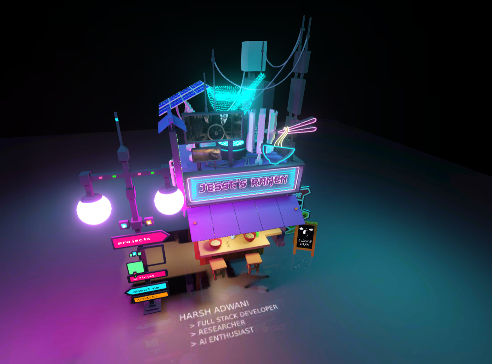

## Demo
https://sagar-1137.github.io/ 
<br><br>
Portfolio project using Three.js and Blender. <br>
All text appearing in the project is actually graphics in .ktx2 format.<br>
So all designs first must be created in .png format as an image, then use a free tool at https://gestaltor.io/ to convert image to graphics. <br>
Then import the created graphics inside the project.


``` bash
# Install dependencies (only the first time)
npm install
```
``` bash
# Run the local server at localhost:8080
npm run dev
```
``` bash
# Build for production in the dist/ directory
npm run build
```

